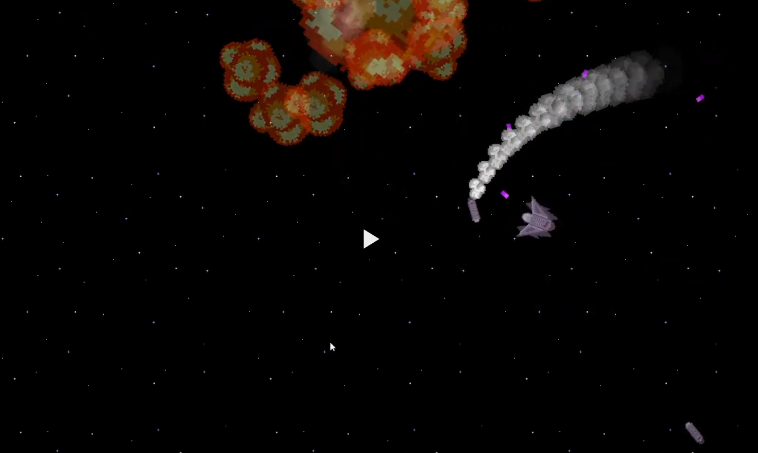
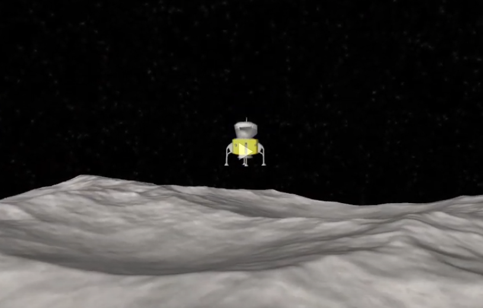

# DuckEngine
General purpose data-driven game engine with custom entity component system.

* General purpose data-driven game engine from scratch using OpenGL with helper libraries.
* A lightweight data-oriented entity component system with implemented 3D Lunar Lander Simulator.
* Integrated real-world physics and used axis aligned bounding boxes to detect collision between objects.
* Terrain mesh collision detection by using subdivided octree data structure.

## [Getting Started](https://github.com/artak10t/DuckEngine/wiki)

## Example: 2D Game

## Example: 3D Lander

